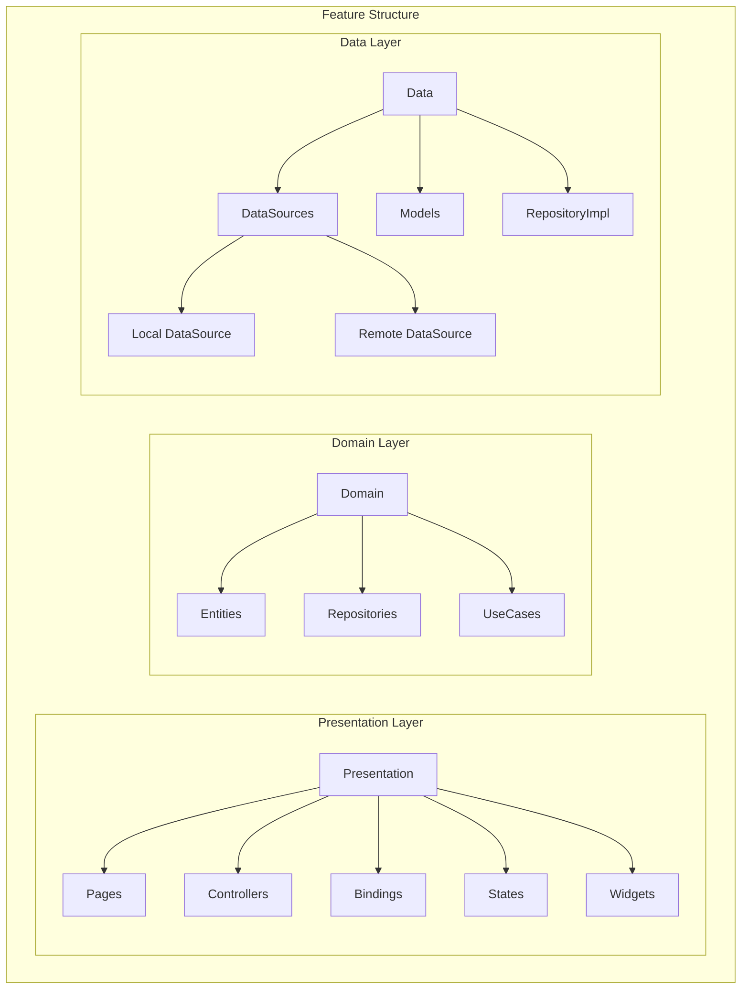

# Feature Generation Guide

This document provides detailed information about creating and managing features using CleanForge Feature Brick.

[← Back to Main Documentation](README.md) | [Hooks Guide →](HOOKS_GUIDE.md)

## Key Features

### 1. Automatic Routing Integration
CleanForge automatically:
- Generates route definitions for new features
- Adds routes to the central routing configuration
- Sets up GetX bindings for dependency injection
- Creates named route constants
- Handles route parameters and arguments

Example of auto-generated route configuration:
```dart
class AppPages {
  static final routes = [
    GetPage(
      name: Routes.HOME,
      page: () => const HomePage(),
      binding: HomeBinding(),
    ),
    // New routes automatically added here
  ];
}
```

### 2. Smart Code Generation
- Generates complete feature structure
- Creates necessary boilerplate code
- Sets up proper dependency injection
- Implements error handling patterns
- Adds logging infrastructure

### 3. Built-in State Management
- Automatic GetX controller setup
- State class generation with immutability
- Reactive state management patterns
- Error and loading state handling

### 4. API Integration Support
- REST client configuration
- API endpoint management
- Error handling middleware
- Response mapping
- Offline support structure

### 5. Development Utilities
- Pre-configured logger
- Error tracking setup
- Development tools integration
- Performance monitoring hooks

### 6. Theme Management
- Automatic setup of light and dark themes
- Theme switching capability with persistent storage
- Pre-configured widget themes for consistency
- Global theme controller for state management

Example of auto-generated theme setup:
```dart
// Theme controller with automatic persistence
class ThemeController extends GetxController {
  static Rx<ThemeMode> currentTheme = ThemeMode.system.obs;
  static void toggleTheme() {
    currentTheme.value = currentTheme.value == ThemeMode.light
        ? ThemeMode.dark
        : ThemeMode.light;
  }

  // ... other code
}

```

Ready-to-use theme switch widget:
```dart
class ThemeSwitchIcon extends StatelessWidget {
  const ThemeSwitchIcon({super.key});
  @override
  Widget build(BuildContext context) {
      return IconButton(
        icon: Icon(
          ThemeController.isLightMode ? AppIcons.darkMode : AppIcons.lightMode,
          color: Theme.of(context).iconTheme.color,
        ),
        onPressed: () {
          ThemeController.toggleTheme();
          Get.changeThemeMode(ThemeController.currentTheme.value);
        },
        tooltip: Get.isDarkMode ? 'Switch to Light Mode' : 'Switch to Dark Mode',
      );
  }
  }
}
```

Theme configuration with predefined styles:
```dart
class AppTheme {
  static ThemeData lightTheme = ThemeData(
    // Pre-configured light theme settings
  );

  static ThemeData darkTheme = ThemeData(
    // Pre-configured dark theme settings
  );
}
```


## Feature Structure

Each feature follows Clean Architecture principles and is organized as follows:



## Creating a New Feature

1. **Generate Feature Structure**
```bash
mason make cleanforge_feature --feat feature_name
```

2. **Feature Components**

### Data Layer
- Models: Data transfer objects
- DataSources: Data access implementations
- Repository Implementation: Concrete repository implementation

### Domain Layer
- Entities: Business objects
- Repository Interface: Abstract repository definition
- Use Cases: Business logic implementation

### Presentation Layer
- Pages: UI screens
- Controllers: Business logic handlers
- States: Feature state management
- Bindings: Dependency injection
- Widgets: Reusable UI components

## Implementation Guide

### 1. Define Entities
```dart

// This is entity class that is made as per the reponse of an api
class FeatureEntity {
  final String id;
  final String name;
  // ... other properties
  
  FeatureEntity({
    required this.id,
    required this.name,
  });
}

// This is the parameter entity that you want to pass as /parameter/data/body while making api request
class FeatureRequestEntity {
  final String id;

  HomeRequestEntity({required this.id});
}

```

### 2. Create Repository Interface
```dart

// This is the domain layer repository which is used to define functions that is called in use case
abstract class FeatureRepository {
  ResultFuture<FeatureEntity> getFeature(String id);
  ResultFuture<List<FeatureEntity>> getAllFeatures();
  // ... other methods
}
```

### 3. Implement Data Sources
```dart
// This is data source file of data layer, in this file we call the api
class FeatureRemoteDataSource {
  final RestClient client;
  
  Future<FeatureModel> getFeature(String id) async {
    // Implementation
  }
}
```

### 4. Create Repository Implementation
```dart

// This is the repository file(data layer) which implements repository file(domain layer). 
// It basically connects data layer to domain layer
class FeatureRepositoryImpl implements FeatureRepository {
  final FeatureRemoteDataSource remoteDataSource;
  final FeatureLocalDataSource localDataSource;
  
  @override
  ResultFuture<FeatureEntity> getFeature({required FeatureRequestEntity request}) async {
    // Implementation
  }
}
```

### 5. Define Use Cases
```dart

// This is use case file which connect domain layer to presentation layer
// For every use case it is recommended to make seperate use case file
class GetFeatureUseCase implements UseCaseWithParams<FeatureEntity, GetFeatureDataUseCaseParams> {
  final FeatureRepository repository;
  
  @override
  ResultFuture<FeatureEntity> call(String params) async {
    return await repository.getFeature(params);
  }
}

class GetFeatureDataUseCaseParams {
  final FeatureRequestEntity request;
  GetFeatureDataUseCaseParams({required this.request});
}

```

### 6. Create Controller
```dart
class FeatureController extends GetxController {
  final GetFeatureUseCase getFeatureUseCase;
  final featureState state;
  
  Future<void> getFeature(String id) async {
      final request = HomeRequestEntity(
        id: "1",
      );
      final result =
          await getFeatureUseCase(GetFeatureDataUseCaseParams(request: request));
      result.fold(
        (failure) {
          Log.error(failure, ["error while fetching Home Data"]);
          // ... other code
        },
        (data) => state.featureData.value = data,
      )
  }
}
```

### 7. Implement UI
```dart
class FeaturePage extends GetView<FeatureController> {
  @override
  Widget build(BuildContext context) {
    return Scaffold(
      // Implementation
    );
  }
}
```

## Best Practices

1. **Error Handling**
   - Use Either type for error handling
   - Implement proper error messages
   - Handle edge cases

2. **State Management**
   - Keep state immutable
   - Use proper state classes
   - Implement proper loading states

3. **Testing**
   - Write unit tests for use cases
   - Test repository implementations
   - Add widget tests for UI

4. **Code Organization**
   - Follow folder structure
   - Keep files focused and small
   - Use proper naming conventions

## Feature Integration

### Automatic Route Integration
When you generate a new feature, CleanForge automatically:
1. Creates route constants in `app_routes.dart`:
```dart
abstract class Routes {
  static const HOME = '/home';
  static const PROFILE = '/profile';
  // New routes automatically added here
}
```

2. Registers routes in `app_pages.dart`:
```dart
class AppPages {
  static final routes = [
    GetPage(
      name: Routes.HOME,
      page: () => const HomePage(),
      binding: HomeBinding(),
      middlewares: [AuthMiddleware()],
    ),
    // New routes automatically configured
  ];
}
```


### Automatic Binding Setup
CleanForge generates and configures:
1. Feature-specific bindings
2. Dependency injection setup
3. Controller initialization
4. Repository registration
5. Use case configuration

Example of auto-generated binding:
```dart
class FeatureBinding extends Bindings {
  @override
  void dependencies() {
    // Data Sources
    Get.lazyPut<FeatureRemoteDataSource>(
      () => FeatureRemoteDataSourceImpl(client: Get.find()),
    );

    // Repositories
    Get.lazyPut<FeatureRepository>(
      () => FeatureRepositoryImpl(
        remoteDataSource: Get.find(),
        localDataSource: Get.find(),
      ),
    );

    // Use Cases
    Get.lazyPut(() => GetFeatureUseCase(repository: Get.find()));

    // Controllers
    Get.lazyPut(() => FeatureController(
      getFeatureUseCase: Get.find(),
    ));
  }
}
```


## Tips and Tricks

1. **Performance Optimization**
   - Use lazy loading when possible
   - Implement proper caching strategies
   - Optimize UI rebuilds

2. **Maintainability**
   - Keep code DRY
   - Follow SOLID principles
   - Document complex logic

3. **Security**
   - Implement proper data encryption
   - Secure sensitive information
   - Handle authentication properly