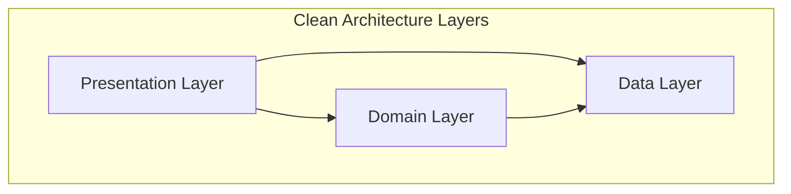
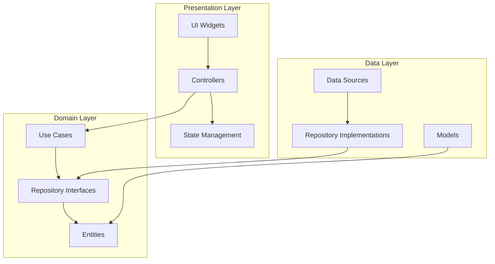
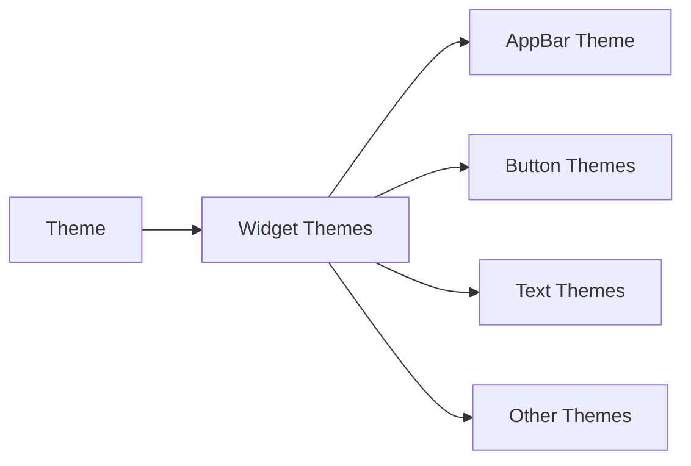
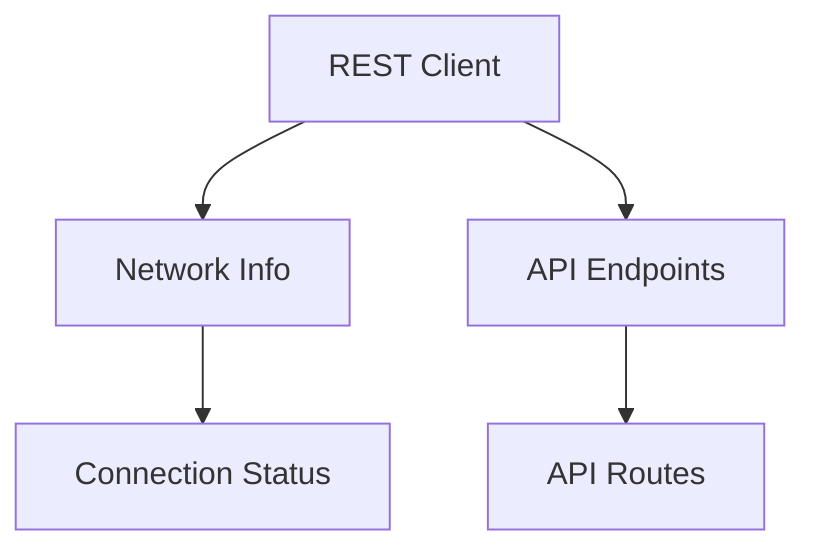

# CleanForge Bricks Documentation

CleanForge Bricks is a powerful Mason brick collection designed to streamline Flutter application development using Clean Architecture principles with GetX state management. This toolkit provides two main bricks: `cleanforge` for project scaffolding (both new and existing projects) and `cleanforge_feature` for feature generation. Currently optimized for GetX state management, with plans to support other state management solutions through community contributions.

## Table of Contents
- [Overview](#overview)
- [Project Structure](#project-structure)
- [Installation](#installation)
- [Usage](#usage)
  - [Creating a New Project](#creating-a-new-project)
  - [Adding a New Feature](#adding-a-new-feature)
- [Architecture](#architecture)
- [Core Components](#core-components)
- [Best Practices](#best-practices)

## Overview

CleanForge Bricks implements Clean Architecture in Flutter applications, promoting:
- Separation of concerns
- Dependency inversion
- Testability
- Scalability
- Maintainability



## Project Structure

The project follows a modular structure with each file having a specific responsibility:

```
lib/
├── main.dart                    # Entry point of the application, configures global settings and initializes app
├── app/
│   ├── app.dart                # Root widget of the application, sets up theme and initial routes
│   ├── app_binding.dart        # Global dependency injection configuration
│   └── page_not_found.dart     # Default 404 error page for invalid routes
├── common/
│   ├── core/
│   │   ├── theme/
│   │   │   ├── theme.dart     # Global theme configuration
│   │   │   ├── theme_controller.dart     # Controller file to control themes
│   │   │   └── widget_themes/ # Individual widget theme configurations
│   │   │       ├── appbar_theme.dart        # AppBar specific theming
│   │   │       ├── bottom_sheet_theme.dart  # BottomSheet customization
│   │   │       ├── checkbox_theme.dart      # Checkbox styling
│   │   │       ├── elevated_button_theme.dart # Button theming
│   │   │       └── text_theme.dart          # Typography definitions
│   │   └── utils/
│   │       ├── errors/
│   │       │   ├── exceptions.dart  # Custom exception definitions
│   │       │   └── failures.dart    # Error types for domain layer
│   │       ├── helpers/
│   │       │   └── helpers.dart     # Utility functions and extensions
│   │       ├── logger/
│   │       │   └── app_logger.dart  # Centralized logging configuration
│   │       ├── navigator_observer/
│   │       │   └── app_navigator_observer.dart # Navigation tracking and analytics
│   │       ├── type_def/
│   │       │   └── type_def.dart    # Common type definitions and aliases
│   │       └── use_cases/
│   │       │   └── use_cases.dart   # Base use case implementations
│   │       └── validators/
│   │           └── app_validators.dart   # Base use case implementations
│   ├── resources/
│   │   ├── app_resources/
│   │   │   ├── app_colors.dart      # Color palette definitions
│   │   │   ├── app_gaps.dart        # Spacing and padding constants
│   │   │   ├── app_gradients.dart   # Gradient style definitions
│   │   │   ├── app_sizes.dart       # Size constants and breakpoints
│   │   │   ├── app_strings.dart     # Localized strings and text constants
│   │   │   └── app_text_styles.dart # Text style definitions
│   │   ├── multimedia_resources/
│   │   │   ├── app_icons.dart       # Icon constants and custom icons
│   │   │   └── app_images.dart      # Image asset references
│   │   ├── network_resources/
│   │   │   ├── api_endpoints.dart   # API endpoint definitions
│   │   │   ├── network_info/
│   │   │   │   └── network_info.dart # Network connectivity handling
│   │   │   └── rest_client/
│   │   │      └──clients/
│   │   │      │   ├──dio_client.dart     # makes network requests with features like interceptors,
│   │   │      │   │                        automatic response decoding, and  request cancellation.
│   │   │      │   └──dio_interceptor.dart # intercept requests, responses, and errors
│   │   │      │                             before handled by the Dio client or returned to your application.
│   │   │      │
│   │   │      └── rest_client.dart  # Dio client configuration
│   │   └── storage_resources/
│   │       ├── local_client.dart     # Local storage implementation
│   │       └── local_keys.dart       # Storage key definitions
│   └── widgets/
│       └── toast_message.dart        # Global toast/snackbar implementation
│       └── theme_switch_icon.dart    # Global icon button widget to switch theme
├── features/
│   └── home/                        # Example feature module
│       ├── data/
│       │   ├── datasources/
│       │   │   ├── local/           # Local storage implementations
│       │   │   └── remote/          # API client implementations
│       │   ├── models/
│       │   │   ├── home_model.dart         # Data models for API responses
│       │   │   └── home_request_model.dart # Request payload models
│       │   └── repositories/
│       │       └── home_repository_impl.dart # Repository implementation
│       ├── domain/
│       │   ├── entities/
│       │   │   └── home_entity.dart        # Business logic entities
│       │   ├── repositories/
│       │   │   └── home_repository.dart    # Repository interfaces
│       │   └── usecases/
│       │       └── home_usecase.dart       # Business logic use cases
│       └── presentation/
│           ├── bindings/
│           │   └── home_binding.dart       # Feature-level dependency injection
│           ├── controllers/
│           │   └── home_controller.dart    # GetX controllers
│           ├── pages/
│           │   └── home_page.dart         # UI screens
│           ├── states/
│           │   └── home_state.dart        # Feature state management
│           └── widgets/
│               └── home_widgets.dart      # Feature-specific UI components
└── routes/
    ├── app_pages.dart               # Route definitions and configurations
    └── app_routes.dart             # Route name constants
```

## Installation

To use CleanForge Bricks in your project:

1. Install Mason CLI:
```bash
dart pub global activate mason_cli
```

2. Add CleanForge Bricks to your project:
```bash
mason add cleanforge
mason add cleanforge_feature
```

## Usage

### Creating a New Project

Generate a new Flutter project with Clean Architecture and GetX:

```bash
# Interactive mode - follow the prompts
mason make cleanforge

# Or with direct arguments
mason make cleanforge --project_name my_app
```

Note: Some IDE integrated terminals (VS Code, Android Studio) may not handle interactive prompts reliably. If the interactive prompt doesn't work in your IDE terminal, either:

- Run the command in a system terminal (Command Prompt or PowerShell on Windows):

```powershell
# Windows PowerShell (example)
cd path\to\your\workspace
mason make cleanforge
```

- Or run the command non-interactively by passing required flags (recommended for CI or automated scripts):

```powershell
# Example: create a project non-interactively
mason make cleanforge --project_name my_app

# Example: create a feature non-interactively
mason make cleanforge_feature --feat auth
```

These alternatives ensure generation works even when interactive prompts fail.

### Setting Up in Existing Project

You can easily integrate Clean Architecture with GetX in your existing Flutter project:

```bash
# Navigate to your existing project
cd my_existing_project

# Run CleanForge in interactive mode
mason make cleanforge

# Or specify project name matching your existing project
mason make cleanforge --project_name my_existing_project
```

This will:
1. Set up the Clean Architecture folder structure
2. Add GetX integration
3. Configure necessary dependencies
4. Create initial boilerplate code
5. Preserve your existing code and assets

### Adding a New Feature

Generate a new feature with all required layers:

```bash
mason make cleanforge_feature --feat user_management
```

## Architecture

CleanForge implements a three-layer Clean Architecture:



### Layer Responsibilities

1. **Presentation Layer**
   - UI Components
   - State Management
   - User Input Handling
   - Dependency Injection

2. **Domain Layer**
   - Business Logic
   - Entity Definitions
   - Use Case Implementation
   - Repository Interfaces

3. **Data Layer**
   - API Integration
   - Local Storage
   - Data Mapping
   - Repository Implementation

## Core Components

### Theme Management


### Resource Management
- AppColors: Color palette management
- AppStrings: Text content management
- AppSizes: Dimension management
- AppGradients: Gradient definitions
- AppTextStyles: Typography system

### Network Layer


### Local Storage
- Secure storage implementation
- Caching mechanisms
- Local data persistence

## Best Practices

1. **Feature Organization**
   - Keep features isolated
   - Implement proper separation of concerns
   - Follow the dependency rule

2. **State Management**
   - Use proper state management patterns
   - Implement proper error handling
   - Manage side effects appropriately

3. **Code Style**
   - Follow Dart style guidelines
   - Maintain consistent naming conventions
   - Document public APIs

## Contributing

We welcome contributions! Please read our contributing guidelines and code of conduct before submitting pull requests.

## License

This project is licensed under the MIT License - see the LICENSE file for details.