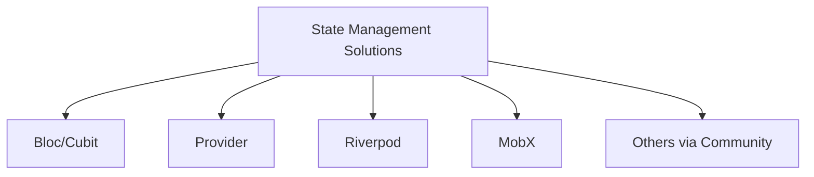
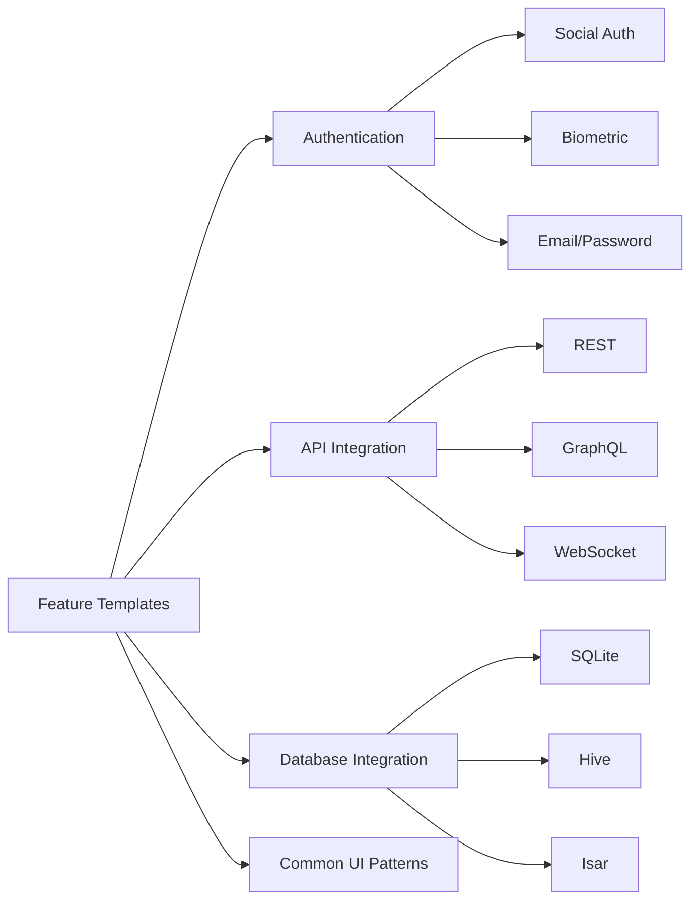
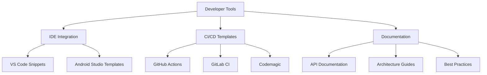
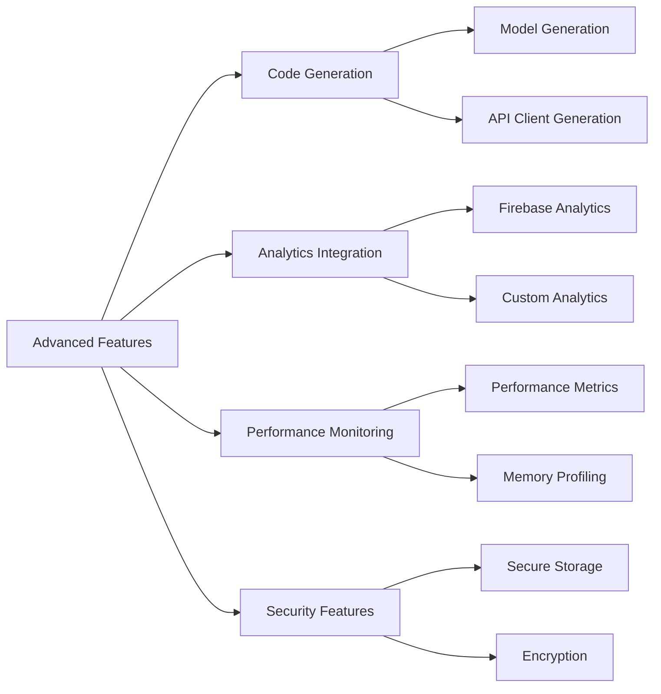

# Roadmap & Future Development

[← Back to Main Documentation](README.md)

## Current State

CleanForge Bricks currently provides robust support for:
- Clean Architecture implementation in Flutter
- GetX state management integration
- Project scaffolding (new and existing projects)
- Feature generation with full Clean Architecture compliance
- Complete testing infrastructure

## Planned Features

### 1. State Management Integration

Currently, CleanForge is optimized for GetX state management. Future plans include support for:

#### Implementation Priority:
1. Bloc/Cubit Integration
2. Provider Support
3. Riverpod Implementation
4. MobX Integration
5. Community-suggested solutions

### 2. Enhanced Feature Templates

### 3. Developer Tools

### 4. Advanced Features

## Community Contribution Areas

### 1. State Management
- Implementation of alternative state management solutions
- Documentation and examples
- Migration guides
- Performance benchmarks

### 2. Templates
- Feature templates for common use cases
- UI component templates
- Integration templates for popular services
- Testing templates

### 3. Tools
- CLI tools for project management
- Code generation tools
- Analysis tools
- Documentation tools

### 4. Documentation
- Tutorial creation
- Best practices guides
- Architecture patterns
- Migration guides

## Getting Involved

### How to Contribute

1. **Choose an Area**
   - Pick from the roadmap above
   - Or propose new features

2. **Discussion**
   - Open an issue for discussion
   - Get feedback from maintainers
   - Align with project goals

3. **Implementation**
   - Fork the repository
   - Create feature branch
   - Implement changes
   - Add tests and documentation

4. **Submit**
   - Create pull request
   - Address feedback
   - Maintain your contribution

### Community Guidelines

1. **Code Quality**
   - Follow Dart style guide
   - Write tests
   - Document your code
   - Keep it maintainable

2. **Communication**
   - Be respectful
   - Be constructive
   - Be clear
   - Be helpful

3. **Maintenance**
   - Help maintain your contributions
   - Address issues
   - Update documentation
   - Support users

## Get Started

To contribute to CleanForge's future:

1. Star the repository
2. Fork the project
3. Pick an area from the roadmap
4. Start contributing!

See [CONTRIBUTING.md](../CONTRIBUTING.md) for detailed guidelines.